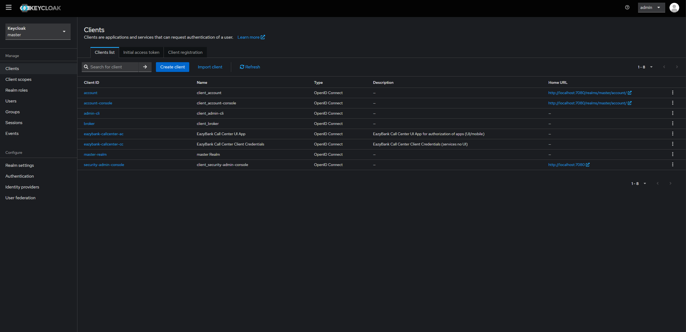
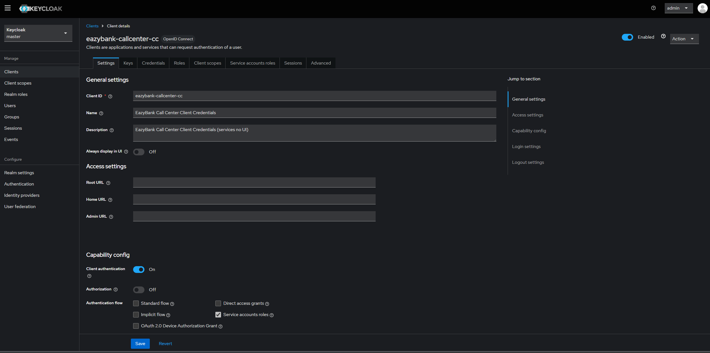
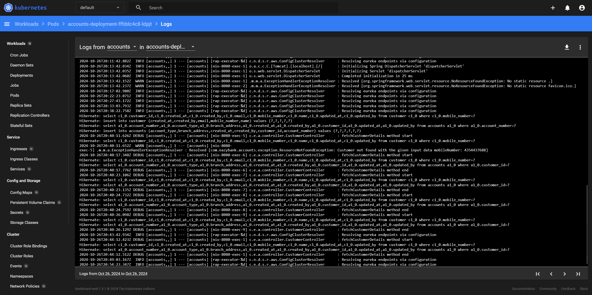
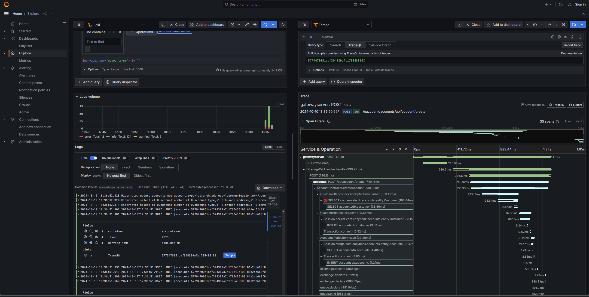

# Understand how microservices work with a fictional bank

# How to run

# 1. deploy the container

To do this, you will need `Docker` and `Docker Compose` on your system.

```
    ~$ cd section13/docker-compose/default
    ~$ docker compose up -d

```

You can pick any profile from, `default`, `prod` or `qa` simply change to the appropriate directory under `/docker-compose` to either `/docker-compose/prod` or `/docker-compose/qa`.

# 2. To tear down your containers:

```
    ~$ cd section13/docker-compose/default
    ~$ docker compose down
```

# 3. Running in Kubernetes Cluster

You can also run this entire application using kubernetes. See Section about `Kuberentes` below to `section 6`.

# 4. About the project

This is a demo project provides a look at best practices in microservices. From dynamically loading configuration from remote repos with webhook refreshes via spring cloud monitor with /monitor,
to best practices in microservices resiliency patterns such as:

- Circuit breakers
- Fallback (applied at the Gateway level, OpenFeign resources as well as at some service endpoints)
- Retry
- Rate Limiting (for preventing DDos Attacks)

It also applies inter-service communication in a decalarative manner using OpenFeign, leverages RabbitMQ for event streaming and use Spring Cloud functions with Cloud Stream for an easy FaaS integration with cloud-stream-binder-rabbit.

# 4. Changing stream binder

If you wish to change the stream binder configuration, you simply need to replace `spring-cloud-stream-binder-rabbit` with your prefered binder abstraction, example: `spring-cloud-stream-binder-rabbit`.

Then you need to replace assign the configuration for the broker inside the `application.yml` of the service you want to use kafka. This must be set for both Producer and Consumer.

Example:

```
spring:
  application:
    name: "accounts"
  cloud:
    stream:
      kafka:
        binder:
          brokers:
            - localhost:9092

```

# 5 Security

This Project also made use OAuth2 server thourough kecloak by creating both a Authorization Code Grant Type client and a Client Credentials Grant Type client.

## 5.1. Keycloak OAuth2 Server

Keycloak was used in this project to offer greater security at the gateway level by leveraging both Authorization Code & Client Credentials Grant Types available with OAuth2 and OpenID Connect.

Used Simple Roles like `ACCOUNTS`, `CARDS`, `LOANS`

## 5.2. Client View

Here you can see a few clients including:

- eazybank-callcenter-cc (Client Credentials Grant Type)
- eazybank-callcenter-ac (Authorization Code Grant Type)



## 5.3. View of Client Credentials Grant Types



# 6 Kubernetes

To deploy the project in Kubernetes use the deployment files under the `section15/kubernetes`.

The files have a `number prefix` to specify the other in which they must be deployed because there are some inter-dependencies.

Ex: accounts-deployment needs accountsdb to be running, and both depend on `configMap` and `secrets` to services be up.

## 6.1. Kubernetes accounts deployment



# Grafana DashBoard (Loki + Tempo)

Here you can see the Grafana dashboard showing service logs with Loki and distributed traces paths with Tempo


